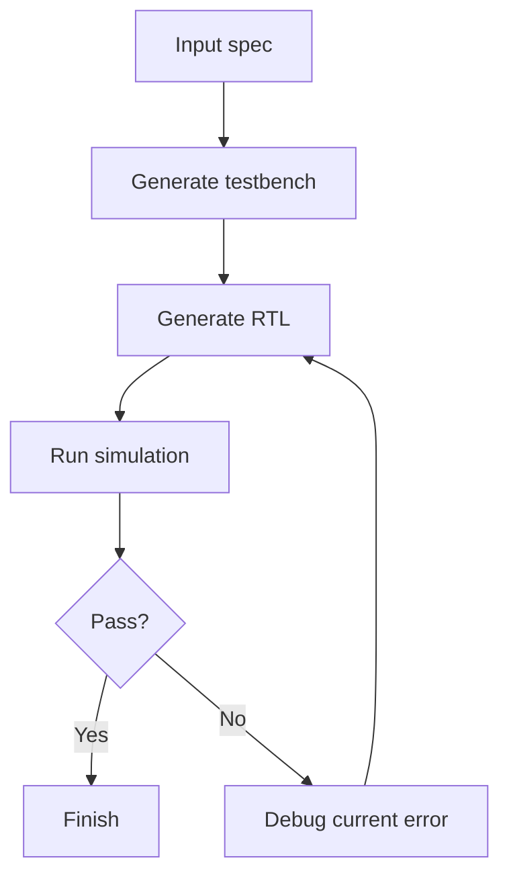
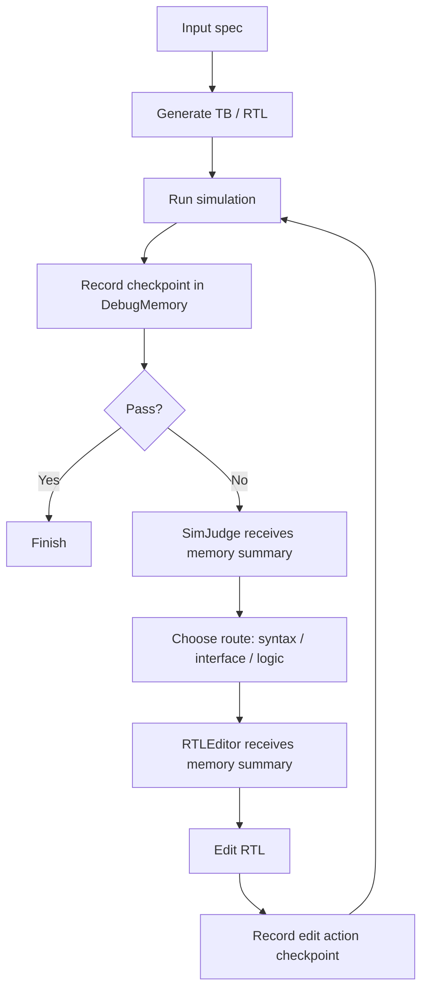
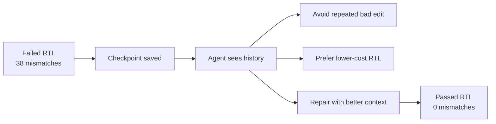

# MarkMAGE Memory Persistence 修改报告

## 1. 一句话总结

我在原始 MAGE / 组员 routing 版本上，加了一个 **in-memory debug checkpoint memory**。

简单说就是：

> 原来 MAGE 每一轮 debug 主要看当前错误；现在我的版本会记住之前每一轮错在哪里、错了多少、改了什么、哪一轮最好，然后把这些历史信息交给后面的 agent 参考。

我没有重写组员的 **agent routing**。
组员的 routing 仍然负责判断错误属于：

```text
syntax / interface / logic
```

我的 memory 只是给 routing 和 RTL repair 提供更多历史上下文。

## 2. 原始 MAGE 是怎么工作的

原始流程大概是这样：



这个流程可以跑，但问题是：

- 每一轮 debug 之间没有明确的 memory。
- Agent 不一定知道上一轮改了什么。
- Agent 不一定知道哪一轮 mismatch 最少。
- 如果某次修改让结果变差，系统没有明确记录这个趋势。

所以它更像是：

```text
看当前错误 -> 修一下 -> 再看当前错误 -> 再修一下
```

## 3. 我修改后的流程

我加了 `DebugMemory`，每一轮仿真或修复后都会保存一个 checkpoint。



现在每一轮都会留下记录，后面的 agent 可以看到历史。

## 4. Memory 里面保存什么

每个 checkpoint 会保存这些信息：

```text
stage               当前阶段，比如 simulation review / rtl candidate / editor action
rtl_digest          当前 RTL 的短 hash，用来区分不同版本
is_syntax_pass      语法是否通过
is_sim_pass         仿真是否通过
mismatch_count      mismatch 数量
first_mismatch_time 第一次 mismatch 出现的时间
output_mismatches   哪些输出信号错了
action              RTLEditor 做过什么修改
cost                当前状态的代价，越低越好
```

可以理解成一张 debug 记录表：

| Iteration | 状态 | mismatch | 说明 |
|---|---:|---:|---|
| 1 | Failed | 38 | 初始 RTL 仿真失败 |
| 2 | Better/Worse | 变化中 | 根据 memory 继续修 |
| N | Passed | 0 | 最终通过 |

## 5. Memory 怎么帮助 agent

以前 agent 只看到当前错误，现在它还会看到类似这样的提示：

```text
Best checkpoint so far:
stage=rtl_candidate_2
mismatches=0
first_mismatch_time=None

Recent failed checkpoint:
stage=tb_or_rtl_debug_round_1
mismatches=38
first_mismatch_time=5
```

这可以帮助 agent 做三件事：

1. 避免重复同样失败的修改。
2. 优先保留 mismatch 更少的 RTL。
3. 如果新修改变差，可以回头参考之前更好的状态。

图示：



## 6. 我具体改了哪些文件

### Memory 核心

- `src/mage/debug_memory.py`
  - 新增 `DebugMemory`
  - 新增 `StateCheckpoint`
  - 负责记录 checkpoint、解析 mismatch、计算 cost、生成 memory summary。

### 接入主流程

- `src/mage/agent.py`
  - 初始化 `DebugMemory`
  - 增加 `record_debug_checkpoint()`
  - 在 simulation、candidate generation、RTL editor 前后记录 memory。
  - 把 memory summary 传给 `SimJudge` 和 `RTLEditor`。

### 接入 SimJudge

- `src/mage/sim_judge.py`
  - 加入 `MEMORY_PROMPT`
  - `SimJudge` 判断 routing 时可以看到历史 checkpoint。

### 接入 RTLEditor

- `src/mage/rtl_editor.py`
  - `RTLEditor` 修改 RTL 时可以看到 memory summary。
  - 每次 edit action 后都会记录新的 checkpoint。

### 运行稳定性修复

- `src/mage/utils.py`
  - 修复模型返回 ```json 包裹时 JSON 解析失败的问题。

- `src/mage/bash_tools.py`
  - 修复 Windows 下 `iverilog ...; vvp ...` 命令执行问题。

- `src/mage/gen_config.py`
  - 让 `gpt-5.4-*` 模型名可以正常初始化。

### 测试和配置

- `tests/test_debug_memory.py`
  - 测试 memory checkpoint 和 JSON 清理。

- `tests/test_top_agent.py`
  - 当前运行模型改成 `gpt-5.4-nano`。

## 7. 当前 benchmark 结果

目前已经完成 VerilogEval-V2 full benchmark：

```text
Model: gpt-5.4-nano
Benchmark: VerilogEval-V2
Arm: B2 routed + memory persistence
Tasks: 156
```

输出结果：

```text
Raw pass: 139/156
Raw pass rate: 0.891
Failed tasks: 17
debug_memory.json files: 156/156
```

和组员已有 raw attempted totals 对比：

| Arm | Raw pass | Raw pass rate |
|---|---:|---:|
| B0 MAGE baseline | 138/156 | 0.885 |
| B1 routed | 134/156 | 0.859 |
| B2 routed + memory persistence | 139/156 | 0.891 |

注意：组员的 strict valid-pair comparison 排除了 17 个 workflow-incomplete pairs。现在只知道数量，不知道具体 task list，所以这里先给 raw comparison。拿到那 17 个 excluded task 名单后，可以再算 B2 的 valid-task Pass@1。

这说明：

- API 可以正常使用。
- MAGE 完整流程可以跑通。
- Memory persistence 没有破坏组员 routing。
- 156 个 full benchmark tasks 都成功生成了 `debug_memory.json`。
- B2 raw pass rate 高于组员当前 B1 routed raw pass rate。

## 8. 和原始 MAGE 相比，我的贡献是什么

| 对比项 | 原始 MAGE | 我的 MarkMAGE |
|---|---|---|
| 是否保存 debug 历史 | 没有明确 checkpoint memory | 有 `DebugMemory` |
| 是否记录 mismatch 数量 | 主要在 log 里 | 结构化保存 |
| 是否记录第一次 mismatch 时间 | 主要在 log 里 | 结构化保存 |
| 是否记录 editor action | 不作为统一 memory | 保存到 checkpoint |
| 是否知道哪轮最好 | 不明确 | 有 best checkpoint |
| 是否改变 routing | 无 | 不改变 routing，只提供 memory |

一句话：

> 原始 MAGE 是“当前轮修当前错误”；我的版本是“带着历史记录修当前错误”。

## 9. 目前还缺什么

现在已经完成：

```text
Implementation: done
Full benchmark: raw pass 139/156
debug_memory.json export: done
enable_debug_memory switch: done
```

还没有完成：

```text
Strict valid-pair B2 comparison
```

所以目前可以说 raw attempted comparison 中 B2 比 B1 高，但 strict valid-pair comparison 还需要组员提供 excluded task list。

最准确的结论是：

> Memory persistence has been implemented and evaluated on the full VerilogEval-V2 attempted set. B2 routed + memory persistence achieved 139/156 raw pass rate, slightly higher than the reported B1 routed raw result of 134/156.

## 10. 新增的两个实验支持功能

为了方便做 full benchmark 和 slide，我又补了两个小功能。

### 10.1 `debug_memory.json`

每个 task 跑完后，现在会导出：

```text
debug_memory.json
```

里面保存所有 checkpoint，例如：

```text
checkpoint_count = 4
best_checkpoint = rtl_candidate_3
best_mismatch = 0
best_cost = 0
```

这个文件的作用是：

- 不用翻很长的 `output.txt`。
- 可以直接看到 memory 记录了什么。
- full benchmark 后可以统计每个 task 的 debug 过程。
- 做 presentation 时可以展示 checkpoint 变化。

### 10.2 `enable_debug_memory`

现在有一个开关：

```text
enable_debug_memory = True
```

如果打开，就是：

```text
routed + memory persistence
```

如果关闭，就是：

```text
routed only
```

这个开关的作用是做公平对比：

```text
B1 routed
B2 routed + memory persistence
```

同一份代码，只改开关，就可以比较 memory 有没有帮助。

## 11. 下一步建议

然后再跑 full benchmark：

```text
B2 = routed + memory persistence
VerilogEval-V2 full 156 tasks
Model = gpt-5.4-nano
rtl_max_candidates = 5
```
